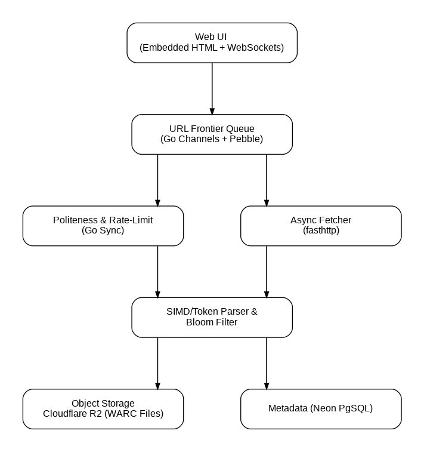

# 🚀 SOTA Web Crawler in Go

A production-grade, ultra-high-throughput, decoupled event-driven web crawler built in **Go**. Engineered for extreme concurrency, $0-cost cloud deployment, ISO WARC archiving, and real-time observability.


---

## 📐 Architecture Overview



```
                      +-----------------------------------+
                      |   Real-Time Operations Dashboard  |
                      | (Embedded Control Center + SSE)   |
                      +-----------------+-----------------+
                                        |
                                        v
                        +---------------+---------------+
                        |  URL Frontier Queue Engine    |
                        | (Go Channels + Pebble DB)     |
                        +---------------+---------------+
                                        |
             +--------------------------+--------------------------+
             |                                                     |
             v                                                     v
+--------------------------+                             +--------------------+
|    Politeness Engine     |                             | Async HTTP Fetcher |
| (Per-Host Rate Limiter)  |                             |     (fasthttp)     |
+------------+-------------+                             +----------+---------+
             |                                                     |
             +--------------------------+--------------------------+
                                        |
                                        v
                        +---------------+---------------+
                        |   Streaming HTML Tokenizer &  |
                        |  Probabilistic Deduplicator   |
                        +---------------+---------------+
                                        |
                   +--------------------+--------------------+
                   |                                         |
                   v                                         v
     +---------------------------+             +---------------------------+
     | ISO WARC Compliance Sink  |             | Crawl Telemetry Store     |
     | Cloudflare R2 (S3 Storage)|             | Neon PostgreSQL (pgx/v5)  |
     +---------------------------+             +---------------------------+
```

---

## ✨ Key System Features

- 🏎️ **Zero-Allocation HTTP Engine:** Powered by `valyala/fasthttp` for maximum throughput with minimal Go Garbage Collection (GC) overhead.
- 💾 **Embedded LSM-Tree Frontier:** Utilizes **Pebble DB** (developed by CockroachDB) to maintain millions of queued URLs persistently on disk without running out of RAM.
- 🧠 **Probabilistic Deduplication:** In-memory **Bloom Filter** (`bitsandblooms/bloom`) eliminates 99.9% of duplicate URL disk lookups in $< 1 \mu s$.
- 🛡️ **Politeness & Rate-Limiting Engine:** Token-bucket domain throttling (`golang.org/x/time/rate`) to prevent 429 response bans and enforce per-host delays.
- 📦 **ISO Standard WARC Exporter:** Exports crawled web pages directly into `.warc.gz` archives (compatible with Internet Archive & Common Crawl tools).
- 📊 **Real-Time Control Center:** Embedded web dashboard via Go `go:embed` and Server-Sent Events (SSE) for live throughput monitoring and visual link trees.
- ☁️ **$0 Cloud Deployment Blueprint:** Runs natively on free-tier cloud platforms (Render, Fly.io, Koyeb) backed by Cloudflare R2 (10 GB free object storage) and Neon PostgreSQL.

---

## 🛠️ Technology Stack

| Layer | Component | Choice | Why This Choice? |
|---|---|---|---|
| **Runtime** | Core Language | **Go 1.22+** | Native concurrency (`goroutines`, `channels`), fast compilation, tiny memory footprint. |
| **Frontier** | Persistent Queue | **Pebble DB** | Embedded LSM-tree KV database; fast sequential writes, zero hosting cost. |
| **Network** | Async Transport | **fasthttp** | Up to 10x faster than `net/http` with zero buffer allocation per request. |
| **Deduplication** | Memory Filter | **Bloom Filter** | $O(1)$ constant time check in RAM (~12 MB RAM per 10M URLs). |
| **Politeness** | Rate Limiter | **Go Sync (`x/time/rate`)** | In-process token bucket algorithm operating at nanosecond speed. |
| **Storage Sink** | WARC Archives | **Cloudflare R2** | S3-compatible object storage with **10 GB free** and **$0 egress fees**. |
| **Metadata** | Crawl Analytics | **Neon PostgreSQL** | Serverless Postgres with instant cold-start auto-resume for live demos. |
| **Dashboard** | Observability UI | **Go Embed + SSE** | Single static binary deployment with real-time browser metric updates. |

---

## 📂 Project Directory Structure

```
sota-crawler/
├── cmd/
│   └── crawler/
│       └── main.go              # Application entrypoint & CLI flags
├── internal/
│   ├── domain/                  # Core domain entities & metrics models
│   ├── frontier/                # Pebble DB persistent URL Frontier & Go channels
│   ├── fetcher/                 # fasthttp connection-pooled async client
│   ├── politeness/              # Per-host token-bucket rate limiter
│   ├── parser/                  # HTML link parser & Bloom Filter deduplicator
│   ├── storage/                 # WARC exporter, R2 storage & Neon DB sync
│   └── web/                     # Embedded web control center (HTML/SSE)
├── data/                        # Local Pebble DB directory & WARC output
├── go.mod
└── README.md
```

---

## 🚦 Getting Started

### Prerequisites
- **Go 1.22** or higher installed.

### Local Installation & Running

1. **Clone the repository:**
   ```bash
   git clone https://github.com/your-username/sota-crawler.git
   cd sota-crawler
   ```

2. **Download dependencies:**
   ```bash
   go mod download
   ```

3. **Run in Local Mode:**
   ```bash
   go run cmd/crawler/main.go -seed="https://example.com" -depth=3 -workers=10
   ```

4. **Access the Live Dashboard:**
   Open `http://localhost:8080` in your web browser to monitor live metrics, active workers, and download generated WARC files.

---

## ⚙️ Environment Configuration

For cloud deployment (Render / Fly.io), configure the following environment variables:

| Variable | Description | Default (Local Mode) |
|---|---|---|
| `PORT` | Web Dashboard Port | `8080` |
| `DATA_DIR` | Pebble DB Storage Directory | `./data/pebble` |
| `NEON_DATABASE_URL` | Neon PostgreSQL Connection String | *Disabled (Local In-Memory)* |
| `R2_ACCOUNT_ID` | Cloudflare R2 Account ID | *Disabled (Local WARC Disk)* |
| `R2_ACCESS_KEY_ID` | Cloudflare R2 Access Key ID | *Disabled* |
| `R2_SECRET_ACCESS_KEY` | Cloudflare R2 Secret Access Key | *Disabled* |
| `R2_BUCKET_NAME` | Cloudflare R2 Bucket Name | `sota-crawler-archive` |

---

## 🧪 Verification & Benchmarks

Run unit tests and benchmarks:

```bash
# Run unit tests
go test -v ./...

# Run benchmark tests (Parser & Bloom Filter throughput)
go test -bench=. -benchmem ./internal/parser/...
```

---

## 📄 License

This project is licensed under the **MIT License**.
